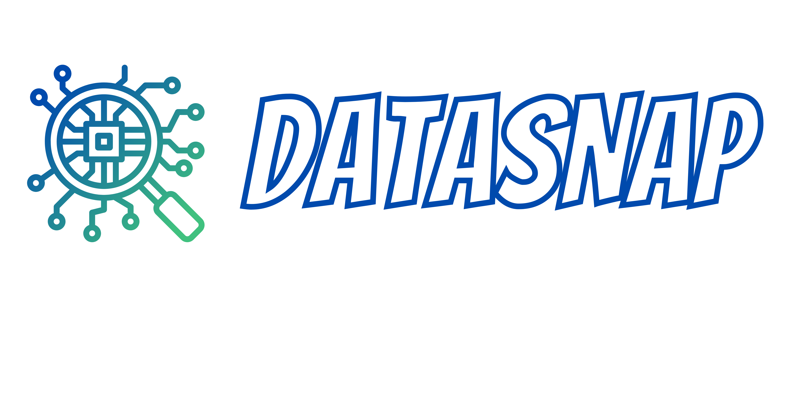

# 

**Datasnap**  is a fast data exploration tool that allows you to explore your data via natural language questions and the help of an automatically generated EDA report.

- **Features**:
  - Built and deployed with [Streamlit](https://streamlit.io/)
  - Search engine based on semantic transformers model ([SBERT](https://www.sbert.net/))
